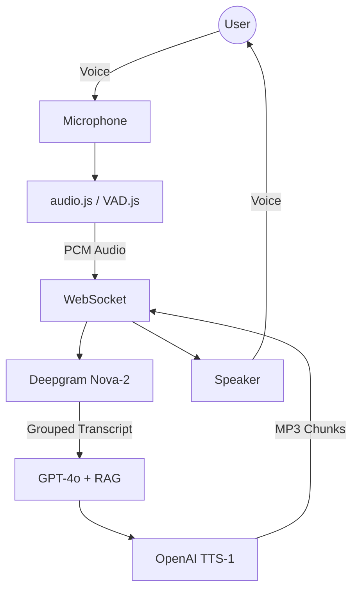

# Voice AI Conversation System (NexaNova)

A high-performance, real-time Voice AI assistant designed for natural, "ChatGPT-like" vocal interaction. This system leverages state-of-the-art STT, LLM, and TTS models to provide a seamless, session-based conversation experience with integrated Retrieval-Augmented Generation (RAG).

## 🚀 Key Features

- **ChatGPT-like Interaction**: Implements smart transcript grouping with a 1-second silence fallback, ensuring natural back-and-forth without cutting off user thoughts.
- **Session-Synchronized WebSockets**: WebSockets only connect when the conversation starts and close when it ends, preventing idle timeouts and optimizing resources.
- **Robust RAG Pipeline**: Dynamically indexes documents (PDF, TXT, DOCX) into a FAISS vector store. The LLM is optimized for phonetic STT error correction (e.g., "river" vs "reward").
- **Instant Interruption**: Client-side Voice Activity Detection (VAD) allows users to speak over the AI, instantly pausing playback and signaling the backend to flush queues.
- **Bi-directional Feedback**: Real-time status updates and user transcripts are streamed to the UI for transparent interaction.

## 🏗 System Architecture

The system follows a full-duplex streaming pipeline designed for low latency.



For a deep dive into the technical design, see **[architecture.md](./architecture.md)**.

## 🛠 Setup & Installation

### 1. Prerequisites
- Python 3.10+
- OpenAI API Key
- Deepgram API Key

### 2. Environment Configuration
Create a `.env` file in the root directory and add your credentials:
```bash
OPENAI_API_KEY=your_openai_key
DEEPGRAM_API_KEY=your_deepgram_key
```

### 3. Install Dependencies
```bash
pip install -r requirements.txt
```

## 🏃‍♂️ Running the System

### Step 1: Start the Backend
```bash
uvicorn backend.main:app --reload --port 8000
```

### Step 2: Serve the Frontend
You can use any local HTTP server. For example, using Python:
```bash
cd frontend
python -m http.server 8080
```

### Step 3: Access the AI
1. Open `http://localhost:8080` in your browser.
2. Click **"Start Conversation"** once.
3. Speak naturally. The AI will listen, process your thought pauses, and respond via voice.
4. Click **"Stop Conversation"** to end the session.

## 📁 Knowledge Base Ingestion
- Place your `.pdf`, `.txt`, or `.docx` files into the `knowledge_base/` directory.
- Use the **"Upload Knowledge Files"** button in the UI to dynamically inject new information into the AI's memory.

## 📊 Latency Benchmark
- **STT**: ~300ms
- **LLM Thinking**: ~200ms
- **TTS Synthesis**: ~150ms
- **Total Loop Latency**: < 1.2s (Real-time performance)
