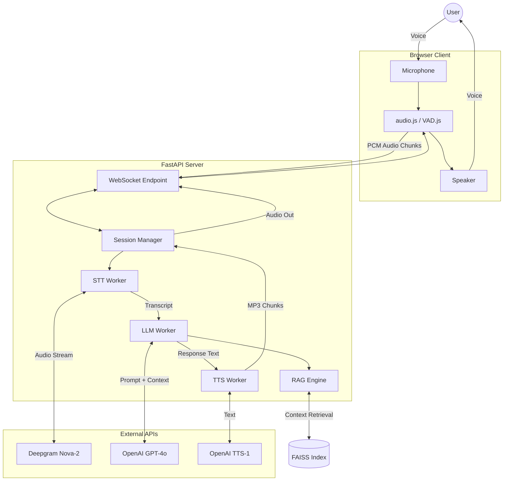

# System Architecture: Voice AI Assistant

This document outlines the architectural design and real-time data flow of the Voice AI Assistant. The system is designed for low-latency, "ChatGPT-like" vocal interaction with integrated Retrieval-Augmented Generation (RAG).

## High-Level Architecture

The system follows a modular, event-driven architecture utilizing WebSockets for full-duplex communication between the browser and the Python backend.

## Core Components

### 1. Frontend (Browser)
- **Audio Capture**: Captures raw PCM audio at 48kHz and downsamples to 16kHz for STT efficiency.
- **Voice Activity Detection (VAD)**: Runs locally in the browser to detect silence and handle user interruptions instantly.
- **WebSocket Client**: Transmits audio chunks and receives TTS binary data and UI status updates simultaneously.

### 2. Backend (FastAPI & AsyncIO)
- **Session Manager**: Maintains the state of each conversation, including history, interruption flags, and thread-safe queues.
- **Pipeline Orchestrator**: Concurrently runs STT, LLM, TTS, and Communication workers using `asyncio.gather`.

### 3. Speech-to-Text (STT)
- **Provider**: Deepgram (Nova-2 model).
- **Strategy**: Streams audio in 100ms chunks. Implements **Transcript Grouping**: waits for a 1-second pause before finalizing a "thought" to prevent fragmented responses.

### 4. Language Model (LLM) & RAG
- **Model**: OpenAI GPT-4o.
- **RAG Implementation**: 
    - **Vector Store**: FAISS.
    - **Embeddings**: `text-embeddings-3-small`.
    - **Thresholding**: Filters results with a similarity score > 1.0 (L2 distance) to ensure high-confidence context.
    - **Phonetic Handling**: The system prompt is optimized to correct STT phonetic errors (e.g., "river" vs "reward") using semantic context.

### 5. Text-to-Speech (TTS)
- **Provider**: OpenAI (TTS-1 model).
- **Streaming**: Streams MP3 chunks back to the client as soon as the first sentence is generated for near-zero perceived latency.

## Real-Time Conversation Flow

1.  **User Starts Session**: Clicking "Start Conversation" establishes the WebSocket connection.
2.  **Audio Streaming**: Once connected, microphone data is streamed to the backend.
3.  **STT Processing**: Deepgram returns intermediate results. The backend groups these results into a complete sentence.
4.  **Context Retrieval**: If the query is factual, the RAG engine searches the knowledge base.
5.  **LLM Generation**: GPT-4o generates a response using the history and retrieved context.
6.  **TTS Streaming**: Response sentences are sent to OpenAI TTS and streamed back to the client.
7.  **User Stops Session**: Clicking "Stop Conversation" stops the mic and closes the WebSocket, ending the backend session gracefully.

## Technical Stack
- **Languages**: Python (Backend), JavaScript (Frontend).
- **Frameworks**: FastAPI, LangChain.
- **Databases**: FAISS (for vector search).
- **Infrastructure**: WebSockets, AsyncIO.
